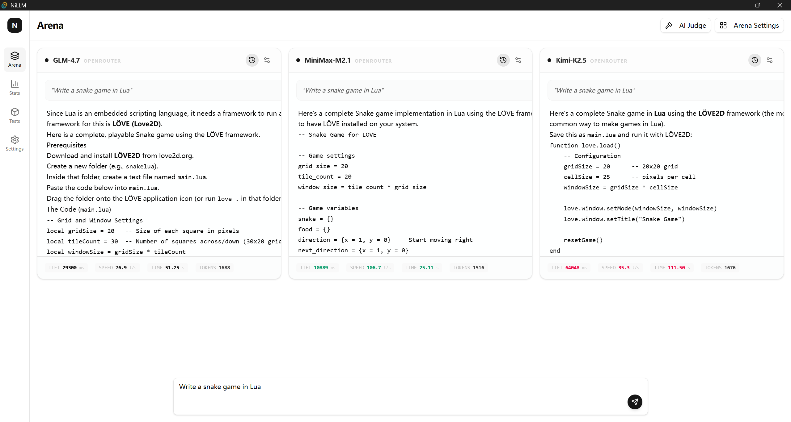

# NiLLM

> **The Professional Model Arena.**

NiLLM is a high-performance desktop arena designed for developers and AI researchers to benchmark LLMs side-by-side.



### Why NiLLM?

- **Live Benchmarking**: Real-time tracking of TTFT, TPS, and total duration.
- **Side-by-side**: Concurrent streaming responses for instant cross-comparison.
- **AI Judging**: Automated quantitative scoring powered by frontier models.
- **Global Control**: Unified management of system prompts and generation parameters.

### Tech Stack

Built with **Tauri**, **React**, and **Tailwind CSS**.

### Quick Start

```bash
pnpm install
pnpm tauri dev
```

---

_Simplicity is the ultimate sophistication._
