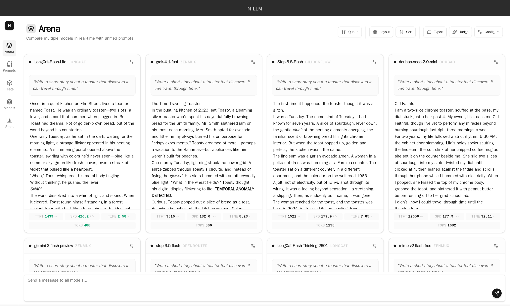
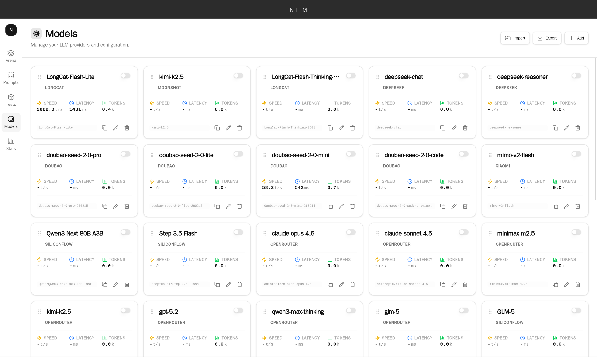

# NiLLM

> **The Professional Model Arena** | **专业的模型竞技场**

A high-performance desktop arena for developers and AI researchers to benchmark LLMs side-by-side, powered by Tauri 2 and Rust.



---

## ⚡️ Features

### ⚔️ Battle Arena

Execute prompts across multiple models simultaneously. Compare generation speed, quality, and logic in real-time with a unified interface.


### 📊 Performance Analytics

Gain deep insights into model performance with our integrated dashboard. Track Time to First Token (TTFT), Tokens Per Second (TPS), and Total Duration across different providers.


### 🎛️ Unified Configuration

Manage all your API keys and system prompts in one secure place. Support for OpenAI, Anthropic, Google, OpenRouter, and custom local endpoints (Ollama/vLLM).



---

## 🛠️ Tech Stack

- **Tauri 2**: Rust-based backend for native performance and security.
- **React 19**: Cutting-edge frontend with TypeScript.
- **Tailwind CSS 4**: Modern, utility-first styling system.
- **Zustand**: Lightweight and scalable state management.

---

## 📦 Installation

Download the latest release for your platform from the [Releases Page](../../releases).

| Platform | Download |
| describe | :--- |
| **macOS** | `NiLLM_x.x.x_x64.dmg` / `NiLLM_x.x.x_aarch64.dmg` |
| **Windows** | `NiLLM_x.x.0_x64-setup.exe` |
| **Linux** | `NiLLM_x.x.x_amd64.AppImage` |
| **Android** | `NiLLM_x.x.x.apk` |

---

## 🚀 Development

Ensure you have Rust and Node.js installed.

```bash
# Install dependencies
pnpm install

# Run development server (Linux/macOS)
pnpm tauri:dev
```

---

## 🇨🇳 中文介绍

### 核心功能

- **⚔️ 竞技场模式**: 同时向多个模型发送指令，直观对比生成速度、质量和逻辑能力。
- **📊 性能分析**: 内置可视化仪表盘，精确追踪首字延迟 (TTFT)、生成速度 (TPS) 和总耗时。
- **🎛️ 统一管理**: 安全管理所有 API 密钥和系统提示词。支持 OpenAI、Anthropic、Google、OpenRouter 及本地模型 (Ollama/vLLM)。

### 技术栈

- **Tauri 2**: 基于 Rust 的高性能后端。
- **React 19**: 现代 TypeScript 前端框架。
- **Tailwind CSS 4**: 最新一代原子化 CSS 引擎。
- **Zustand**: 极简状态管理方案。

### 开发指南

```bash
# 安装依赖
pnpm install

# 启动开发服务器
pnpm tauri:dev
```

---

[MIT License](./LICENSE)
