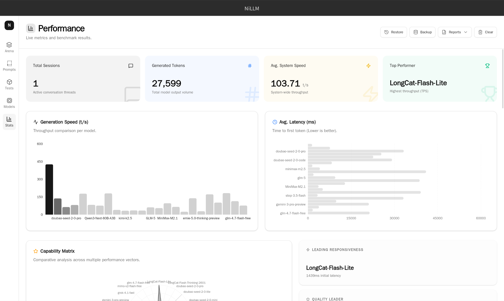
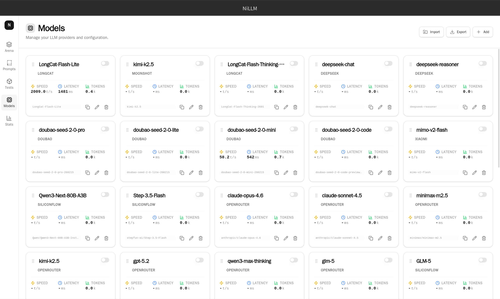

# NiLLM

> **The Professional Model Arena** | **专业的模型竞技场**

A high-performance desktop arena for developers and AI researchers to benchmark LLMs side-by-side, powered by Tauri 2 and Rust.


---

## ⚡️ Features

### ⚔️ Battle Arena

Execute prompts across multiple models simultaneously. Compare generation speed, quality, and logic in real-time with a unified interface.


### 📊 Performance Analytics

Compare successful requests using TTFT, median/P95 latency, sample-weighted generation speed, duration, token usage and ratings. Filter by time, provider and mode; inspect failures, cancellations, estimates and available costs. JSON and CSV exports include the expanded metrics. Costs are reported only when a provider supplies pricing and exact usage.



### 🎛️ Unified Configuration

Manage provider endpoints, local API key configuration and system prompts in one place. Fetch and add a provider’s complete model catalog, search and group configured models, and select an entire provider for the arena. Support for DeepSeek, OpenAI, Anthropic, Google, OpenRouter, and custom local endpoints (Ollama/vLLM).



---

## 🛠️ Tech Stack

- **Tauri 2**: Rust-based backend for native performance and security.
- **React 19.3 / React Router 8** with TypeScript 7 native type checking.
- **Vite 8 / Tailwind CSS 4.3** for development and production builds.
- **AI SDK 7** with native Anthropic and Google adapters and OpenAI-compatible providers.
- **Zustand**: Lightweight and scalable state management.

---

## 📦 Installation

Download the latest release for your platform from the [Releases Page](../../releases).

| Platform    | Download                                          |
| :---------- | :------------------------------------------------ |
| **macOS**   | `NiLLM_x.x.x_x64.dmg` / `NiLLM_x.x.x_aarch64.dmg` |
| **Windows** | `NiLLM_x.x.0_x64-setup.exe`                       |
| **Linux**   | `NiLLM_x.x.x_amd64.AppImage`                      |
| **Android** | `NiLLM_x.x.x.apk`                                 |

---

## 🚀 Development

Use Node.js 24 or newer, pnpm 11 (pinned in `package.json`), and Rust stable. Linux desktop builds also require WebKitGTK 4.1 development libraries.

```bash
# Install dependencies
pnpm install

# Verify types, lint and regression tests
pnpm check

# Build the frontend
pnpm build

# Browser regression tests (one-time browser installation)
pnpm exec playwright install chromium
pnpm test:e2e

# Verify the production bundle and Worker (after pnpm build)
pnpm exec cross-env PLAYWRIGHT_PREVIEW=1 playwright test e2e/provider-arena.spec.ts

# Run desktop development server (Linux/macOS)
pnpm tauri:dev
```

---

## 🇨🇳 中文介绍

### 核心功能

- **⚔️ 竞技场模式**: 同时向多个模型发送指令，直观对比生成速度、质量和逻辑能力。
- **📊 性能分析**: 支持时间、供应商和模式筛选；展示首字延迟及 P95、请求加权速度、成功率、输入/输出 Token、估算标记及已知费用，支持 JSON/CSV 导出。失败、取消和未完成请求不计入性能均值。
- **🎛️ 统一管理**: 通过供应商接口获取模型列表并批量添加，按供应商分组、搜索及选择模型，重复导入会跳过已有配置。支持 DeepSeek、OpenAI、Anthropic、Google、OpenRouter 及兼容接口 (Ollama/vLLM)。密钥保存在本机应用数据中，模型配置导出默认不包含密钥。

### 技术栈

- **Tauri 2**: 基于 Rust 的高性能后端。
- **React 19.3 / React Router 8 / TypeScript 7**: 原生编译器进行类型检查；ESLint 使用兼容的 TypeScript 6 API。
- **Vite 8 / AI SDK 7**: 前端构建使用 Rolldown/Oxc，供应商 SDK 按需加载。
- **Tailwind CSS 4**: 最新一代原子化 CSS 引擎。
- **Zustand**: 极简状态管理方案。

### 开发指南

```bash
# 需要 Node.js 24+、pnpm 11 和 Rust stable
pnpm install --frozen-lockfile

# 类型、lint 和单元测试
pnpm check

# 启动开发服务器
pnpm tauri:dev
```

---

[MIT License](./LICENSE)
