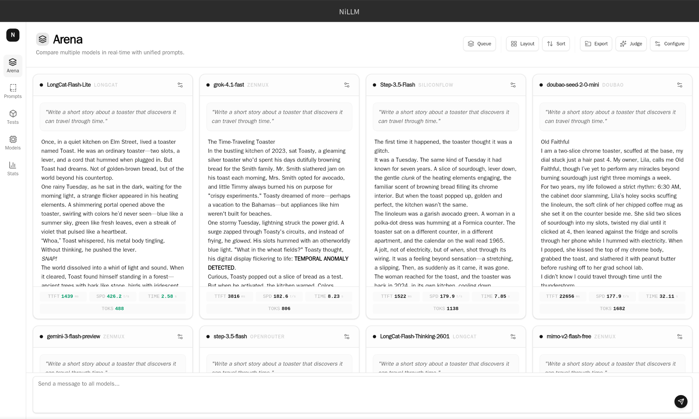

# NiLLM

中文 · [English](./README.md)

用于对比和测试 AI 模型的桌面应用。



## 功能

- 多模型对话与决策任务竞技，支持图片输入和生成。
- 批量测试、参数对比和评分，查看速度、Token 用量、费用及缓存命中率。
- 本地管理供应商、模型、提示词和测试集，支持导入导出。

## 开始使用

从 [Releases](https://github.com/ni00/NiLLM/releases) 下载安装包。在模型页面配置供应商，再到竞技场选择模型开始对比。

发布流程构建的 Linux AppImage 包含 [AppImageUpdate](https://github.com/AppImageCommunity/AppImageUpdate) 更新信息，可用该工具打开 AppImage，检查并下载更新。正式版跟随最新正式 Release，nightly 版跟随已发布的 `nightly` Release；每个 AppImage 都会附带对应的 `.AppImage.zsync` 文件。旧版（包括 v1.0.9）没有更新信息，需要先手动下载一次新版。

## 开发

需要 Node.js 24+、pnpm 11 和 Rust stable。Linux 桌面构建还需要 WebKitGTK 4.1 开发库。

```bash
pnpm install --frozen-lockfile
pnpm tauri:dev   # 桌面应用
pnpm dev         # 浏览器前端
```

[MIT 许可证](./LICENSE)
